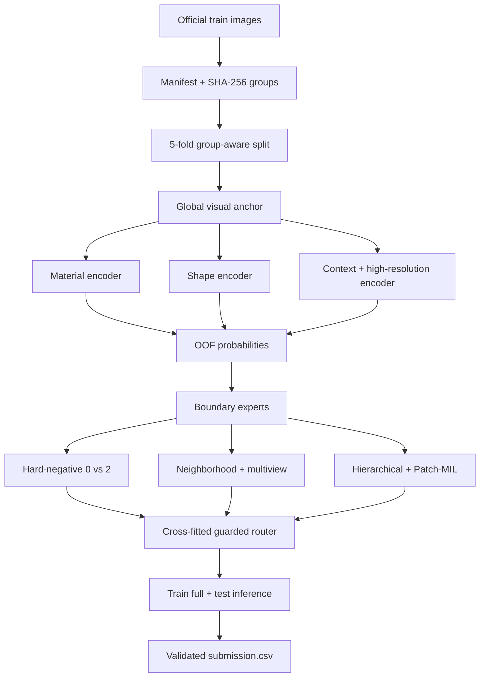

# SATRIA DATA Waste Image Classification

Repository solusi tim untuk **Big Data Challenge (BDC) Satria Data 2026**.
Tugasnya adalah mengklasifikasikan foto sampah ke tiga kelas: **Recyclable**,
**Electronic**, dan **Organic**. Repo ini menyimpan source code, recipe, dan
artefak ringan yang bisa diaudit. Dataset gambar asli, checkpoint besar, dan
label test tidak di-commit.

## Ringkasan eksperimen

| Komponen | Nilai |
|---|---|
| Kelas | `0 Recyclable`, `1 Electronic`, `2 Organic` |
| Data train resmi | 26.527 gambar berlabel |
| Data test | 1.458 ID tanpa label |
| Split validasi | `StratifiedGroupKFold`, 5 fold, seed `2026` |
| Backbone Final514 | `google/siglip2-so400m-patch16-naflex` |
| Resolusi backbone | NaFlex, maksimum 256 patch |
| Head Final514 | Balanced Logistic Regression, `C=0.2` |
| Validasi Final514 | 42 error dari 5.308 row, Macro-F1 `0.9935154626` |

Angka Final514 adalah hasil **Fold-0 validation** dari clean retrain, bukan
skor leaderboard resmi. Evaluasi lokal pasca-run yang tercatat sebagai 0/1.458
hanya regression check setelah recipe dipilih, bukan input pemilihan model.

## Leaderboard BDC Satria Data

Tabel berikut menyalin delapan baris yang terlihat pada screenshot klasemen
yang diberikan untuk dokumentasi repo. Koma desimal dipertahankan seperti pada
sumber. Ini adalah snapshot, bukan data leaderboard live.

| Peringkat | Kode kelompok | Perguruan tinggi | Jumlah unggah | Skor | Waktu unggah | Wilayah LLDikti | Jenis |
|---:|---|---|---:|---:|---|---:|---|
| 1 | SD2026040000331 | Universitas Indonesia | 3 | 100,0000 | 2026-07-19 18.59.49 | 3 | Penyisihan |
| 2 | SD2026040000363 | Universitas Indonesia | 2 | 100,0000 | 2026-07-19 16.36.01 | 3 | Penyisihan |
| 3 | SD2026040000374 | Universitas Indonesia | 3 | 100,0000 | 2026-07-19 19.18.50 | 3 | Penyisihan |
| **4** | **SD2026040000100** | **Institut Teknologi Sepuluh Nopember** | **3** | **100,0000** | **2026-07-31 00.04.14** | **7** | **Penyisihan** |
| 5 | SD2026040000292 | Universitas Telkom | 3 | 100,0000 | 2026-07-31 21.20.05 | 4 | Penyisihan |
| 6 | SD2026040000303 | Universitas Telkom | 3 | 99,9463 | 2026-07-30 23.09.08 | 4 | Penyisihan |
| 7 | SD2026040000027 | Institut Teknologi Sepuluh Nopember | 3 | 99,9462 | 2026-07-29 18.56.11 | 7 | Penyisihan |
| 8 | SD2026040000354 | Universitas Diponegoro | 3 | 99,9462 | 2026-07-31 00.45.21 | 6 | Penyisihan |

Baris peringkat 4 ditandai karena merupakan tim ITS yang terlihat pada
screenshot. Klasemen ini tidak dipakai untuk melatih atau memilih model.

## Metodologi

### 1. Validasi data dan pencegahan leakage

Pipeline membaca folder resmi `train/0_Recyclable`, `train/1_Electronic`, dan
`train/2_Organic`. Setiap gambar divalidasi, lalu hash SHA-256 kontennya dipakai
sebagai `group`. Dengan begitu, salinan gambar identik tidak bisa tersebar ke
train dan validation pada saat yang sama.

`StratifiedGroupKFold` lima fold dengan seed `2026` menjaga proporsi kelas
sekaligus menghormati group. Test hanya dibaca sebagai gambar dan ID submission;
pipeline menolak artefak yang menyatakan penggunaan test label.

### 2. Audit label Final514

Clean retrain Final514 menyimpan dua manifest:

- **feature manifest** dengan 259 perubahan label yang dipakai saat ekstraksi
  fitur;
- **final manifest** dengan 514 perubahan label yang dipakai saat pelatihan
  akhir.

Setiap perubahan dicatat di
[`experiments/final514/results/manifest_changes.csv`](experiments/final514/results/manifest_changes.csv)
dan divisualisasikan pada `swap_contact_sheets/`. Tidak ada perubahan yang
dipilih berdasarkan label test.

### 3. Encoder visual dan preprocessing

Model utama Final514 adalah `SigLIP2 SO400M Patch16 NaFlex` pada revision yang
dipin di [`recipe.json`](experiments/final514/recipe.json). NaFlex memberi model
hingga 256 patch sehingga detail objek kecil tetap terbaca tanpa memaksa semua
foto ke satu rasio crop.

Training memakai resize yang mempertahankan aspect ratio, padding ke bentuk
persegi, crop terkontrol, flip horizontal, serta perubahan ringan pada warna
dan pencahayaan. Model memiliki:

1. head multiclass untuk tiga kelas;
2. head biner khusus batas `Recyclable` versus `Organic`.

Loss multiclass menggunakan class-balanced weighting dan label smoothing. Head
biner diberi bobot tambahan `0.20` supaya batas kelas yang paling sering rancu
tidak diabaikan.

### 4. Tahapan training dan pemilihan head

Clean run melewati warm-up head, fine-tuning backbone parsial, lalu satu
continuation pada subset material yang sudah diaudit. Probabilitas/fitur train
diambil dari fold yang tidak melihat row validasinya.

Balanced Logistic Regression dicoba pada kandidat `C` berikut:
`0.1`, `0.2`, `0.3`, `0.5`, `0.75`, dan `1.0`. Ranking validation dilakukan
berurutan berdasarkan:

1. jumlah error paling sedikit;
2. log-loss paling rendah;
3. Macro-F1 paling tinggi;
4. `C` paling kecil sebagai tie-break.

Hasilnya `C=0.2`, dengan 42 error dan Macro-F1 `0.9935154626` pada 5.308 row.
Tabel lengkap kandidat ada di
[`validation_head_ablation.tsv`](experiments/final514/results/validation_head_ablation.tsv).

### 5. Pipeline multi-expert yang dapat direproduksi

Folder [`pipeline/`](pipeline/) memuat arsitektur end-to-end yang lebih lengkap
daripada clean run Final514 single-model:



Alurnya:

- **Global visual anchor:** ConvNeXtV2-L dan DINOv3 ConvNeXt-L menangkap
  material, bentuk, tekstur, dan konteks.
- **Boundary experts:** expert hard-negative dan directional fokus pada
  residual `0 vs 2`; expert tidak mengubah prediksi `Electronic`.
- **Neighborhood dan multiview:** embedding tetangga serta full image, flip,
  center crop, dan corner crop dipakai untuk menguji stabilitas keputusan.
- **Hierarchical dan Patch-MIL:** satu head tiga kelas digabung dengan head
  biner dan bukti patch penting untuk foto yang memuat banyak objek.
- **Cross-fitted router:** semua fitur router berasal dari OOF prediction.
  Kandidat koreksi diterima hanya jika Macro-F1 OOF membaik, guard antar-fold
  lolos, F1 `Electronic` tidak turun, dan arah koreksi tetap terbatas pada
  `2 -> 0`.

Pilot hierarchical + Patch-MIL yang tercatat meningkatkan Macro-F1 dari
`0.987886` menjadi `0.988332` pada 5.308 held-out train row. Angka pilot ini
berbeda dari hasil Final514 dan tidak boleh dibandingkan sebagai skor leaderboard.

## Struktur repository

Foldering dipisah berdasarkan fungsi supaya root GitHub tetap mudah dibaca:

```text
.
├── README.md
├── .gitignore
├── pipeline/
│   ├── pipeline.py                 # orchestrator end-to-end
│   ├── inference.py                # inference dari artefak OOF
│   ├── modal_backbone_app.py       # Modal app + data protocol
│   ├── architecture_runtime.py     # runtime expert yang dibundel
│   ├── submission_template.csv     # template 1.458 ID
│   ├── pipeline_manifest.json       # stage + SHA-256 pin
│   ├── requirements.txt
│   └── stages/                     # stage 01 sampai 20
└── experiments/
    └── final514/
        ├── modal_pipeline.py       # clean retrain single-model
        ├── recipe.json
        ├── RESULT_SUMMARY.md
        ├── results/                 # artefak ringan + metrics
        └── swap_contact_sheets/     # bukti 514 perubahan label
```

`pipeline/workspace/`, `pipeline/outputs/`, dan `pipeline/final_models/`
diabaikan Git karena berisi output run. Checkpoint besar tetap berada di Modal
Volume, bukan di repository.

## Menjalankan

Validasi struktur dan hash source tanpa GPU:

```powershell
python pipeline/pipeline.py --profile <modal-profile> --dry-run
```

Menjalankan seluruh stage pada Modal:

```powershell
python pipeline/pipeline.py --profile <modal-profile>
```

Resume workspace yang terputus:

```powershell
python pipeline/pipeline.py --profile <modal-profile> --resume
```

Inference dari artefak pipeline yang sudah tersimpan:

```powershell
python pipeline/inference.py `
  --artifact-root pipeline/workspace/rebuild `
  --output-dir pipeline/outputs/artifact-inference
```

Clean retrain Final514 standalone:

```powershell
modal run --detach experiments/final514/modal_pipeline.py
```

Prasyarat Modal: volume `bdc2026-data`, volume `bdc2026-model-cache`, secret
`huggingface-secret`, dan data resmi pada `/data/BDC2026`.

## Batasan dan interpretasi hasil

- Macro-F1 validation tinggi tidak berarti semua contoh ambigu sudah benar.
- Hasil lokal 0/1.458 bukan pengganti skor resmi kompetisi.
- Reproduksi bit-for-bit lintas versi driver CUDA tidak dijamin, tetapi seed,
  split, revision model, recipe, dan hash source dipin.
- Leaderboard pada README adalah snapshot dokumentasi dari screenshot, bukan
  klaim posisi terkini.
